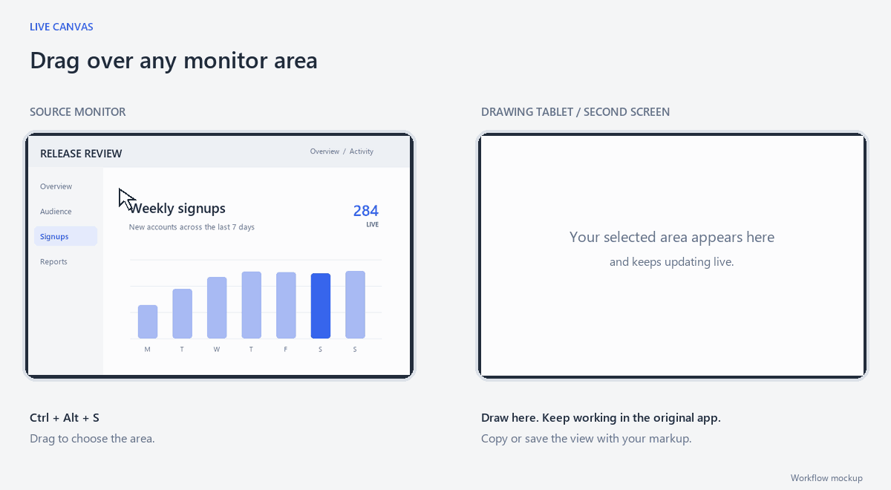
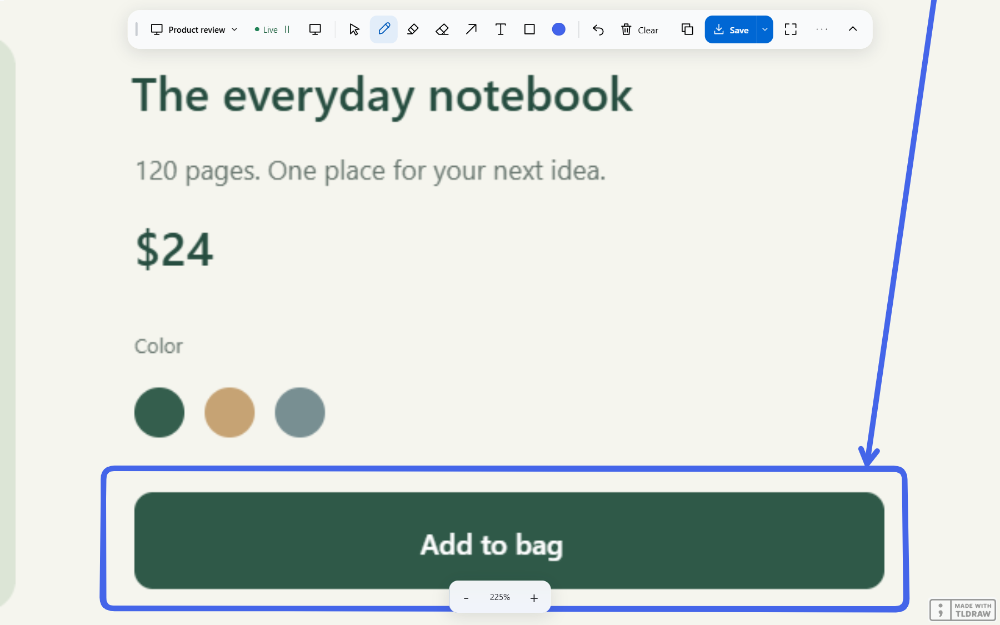
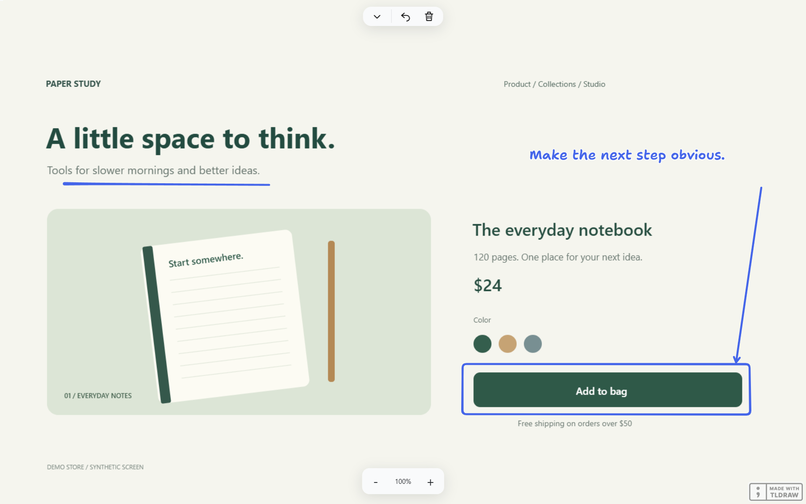

# Live Canvas

**Click and drag over an area of your monitor to open a live, drawable view of it on a drawing tablet or second screen.**



The selected area keeps updating as you work in the original app. Draw over it with a pen or mouse, zoom in on a detail, or freeze a frame to mark it up. Copy or save the view with your annotations when you're ready to share it.

## How it works

1. **Put Live Canvas on your other screen.** Choose the destination display in the Source menu.
2. **Select an area on your monitor.** Move your pointer to the source monitor, press **Ctrl+Alt+S**, then click and drag a rectangle.
3. **That area appears as a live view in Live Canvas.** Draw on top while the original app keeps running.

You can also choose a whole monitor or an application window from the Source menu.

[Watch the zoom and freeze demos](docs/demos/README.md).

## Work with the live view

- **Draw:** pen, highlighter, arrows, shapes, and text, with Undo and Clear.
- **Zoom:** use the bottom -/+ buttons or Ctrl+wheel. Zoom out beyond your crop to see more of the source; tap the percentage to return to the selected area. Touch-capable devices also support pinch and pan.
- **Freeze:** pause the captured image to annotate a moment, then resume the live view.
- **Copy or save:** export the visible picture and annotations as a PNG, or save a smaller snip. The toolbar stays out of the image.



## Present or share

Collapse the toolbar for more space. To show the live annotated view in a call, share the Live Canvas window through your meeting app. To send a still image to a chat or document, click **Copy image** and paste it there.



[See the exported image](docs/screenshots/export.png) or read the [user guide](docs/guide.md).

## Run it

Live Canvas currently runs on **Windows**. This repository provides the source code. You'll need Node.js 22.12 or newer and pnpm 11.19.0.

```powershell
git clone https://github.com/griffinwbrown-arch/live-canvas.git
cd live-canvas
npm install --global pnpm@11.19.0
pnpm install --frozen-lockfile
pnpm dev
```

Local development does not require a tldraw production key. To make an installed Windows app, follow the [build guide](docs/building.md). Production builds require your own appropriate tldraw license.

## Current limitations

- Save or copy before closing; editable sessions are not restored yet.
- Annotations stay in place when the source content scrolls. Freeze the image when you need stable markup.
- The optional **Interact with screen** mode forwards input to the source app. It's experimental, and native scrolling is currently unreliable. **Select** edits your annotations instead.
- Use a different source display or window to avoid capturing Live Canvas inside itself.

See the [audit report](docs/audit.md) for tested behavior and remaining issues.

## Development

[Architecture](docs/architecture.md) | [Contributing](CONTRIBUTING.md) | [Build instructions](docs/building.md)

[](https://github.com/griffinwbrown-arch/live-canvas/actions/workflows/check.yml)

## License

Original Live Canvas code is [MIT licensed](LICENSE), copyright 2026 Griffin Brown. The drawing tools use the [tldraw SDK](https://tldraw.dev/), which has separate production licensing requirements. See [third-party notices](THIRD_PARTY_NOTICES.md).
