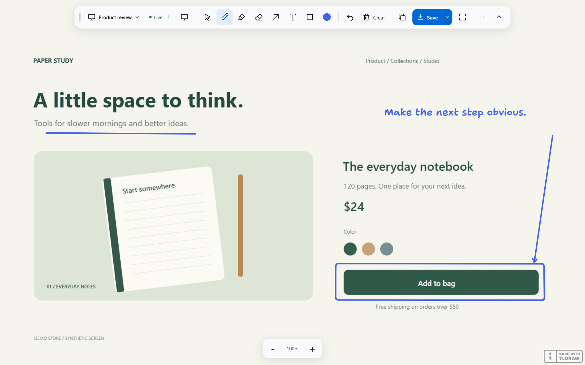

# Live Canvas

**Bring a screen into view. Draw over it. Share the result.**

[](https://github.com/griffinwbrown-arch/live-canvas/actions/workflows/check.yml)

Live Canvas is a Windows desktop app for annotating a live screen, an application window, or a selected region. Built for the Huion Kamvas and other pen displays, it also works with a mouse. Capture a product flow, sketch the change, and copy the picture into a conversation without juggling screenshots and drawing apps.



_Actual app screenshots using a synthetic product-review screen. No private desktop content is shown._

[Get started](#get-started) · [User guide](docs/guide.md) · [Architecture](docs/architecture.md) · [Audit and limitations](docs/audit.md)

## What it does

- **Live capture:** mirror a monitor, window, or region at a requested maximum of 30 fps.
- **Draw and explain:** pen, highlighter, arrows, shapes, text, color, and stroke controls powered by tldraw.
- **Focus the view:** crop, zoom in, zoom back out to the full source, and keep annotations aligned.
- **Freeze a moment:** hold a frame while the source continues changing. Resume when ready.
- **Export picture + ink:** copy to the clipboard, save a PNG, or save a smaller snip. Controls stay out of exports.
- **Keep the canvas open:** full-window workspace with a collapsible toolbar and quick Undo/Clear.
- **Control the source, experimentally:** switch explicitly from selecting annotations to interacting with the captured app.

There is no screenshot-upload service or automatic chat submission. **Copy image**, then paste into your chat. For a call, share the Live Canvas window through your meeting app.

## Focus without losing context

Crop to the part you want to discuss. Use the bottom **− / percentage / +** controls or **Ctrl + wheel** to change scale. Zooming out reveals the source beyond the original crop; tapping the percentage returns to that crop. Touch-capable devices support pinch and finger pan.


The **Kamvas 13 does not support finger touch**. Use the zoom buttons with its pen, or a mouse/trackpad. See [Huion's hardware FAQ](https://support.huion.com/en/support/solutions/articles/44002010211-huion-kamvas-12-13-16-2021-faqs).

## A clean surface for presenting

Collapse the toolbar to keep the picture visible. Undo and Clear remain available. Share the app window using Teams, Zoom, or your meeting app's normal screen-sharing controls. Compatibility with each meeting app has not been individually verified.


[See the exported PNG without app controls](docs/screenshots/export.png).

## Get started

This public release is **source code**, not a prelicensed binary download. Windows 10/11, Node.js 22.12 or newer, and pnpm 11.19.0 are required.

```powershell
git clone https://github.com/griffinwbrown-arch/live-canvas.git
cd live-canvas
npm install --global pnpm@11.19.0
pnpm install --frozen-lockfile
pnpm dev
```

Local development does not require a tldraw production key. The optional Windows launcher, `Launch Live Canvas.vbs`, starts the development app without a terminal after dependencies are installed.

1. Choose **Source → Choose screen or window**.
2. Draw with the pen, arrows, shapes, or text. **Select** moves your annotations, including while the capture is live.
3. Use **Crop view** to focus, or **Freeze** to hold a frame.
4. Click **Copy image** and paste it elsewhere, or **Save** a PNG.

### Build a Windows executable

Production builds require **your own valid tldraw license**, appropriate to your usage and the local app hostname. The SDK is not MIT licensed; see [tldraw's license documentation](https://tldraw.dev/community/license).

```powershell
Copy-Item .env.example .env.local
# Edit .env.local with your license key and a hostname covered by that license.
pnpm package:win
```

Set `VITE_TLDRAW_LICENSE_KEY` and `LIVE_CANVAS_HOST` in `.env.local`. The hostname becomes a local `live-canvas://.../` origin served from bundled files; it does not deploy or contact a website. Ask tldraw about the appropriate license for your desktop distribution. License enforcement and the required attribution are preserved.

The installer appears under `release/`. Build output, installers, and `.env.local` are ignored by Git. A frontend license key is embedded in your own built app; do not assume packaging conceals it.

## Know before using it

- **Save before closing.** Editable sessions are not persisted yet.
- **Annotations belong to the view, not the source document.** They do not track elements when the source scrolls. Freeze for stable markup.
- **Native screen control is experimental.** Clicking, dragging, and typing have passed a local test-window check. Native scrolling has failed repeated checks and is unresolved. Protected, elevated, raw-input, or minimized applications may behave differently.
- Capturing the display that contains Live Canvas can produce a recursive mirror. A separate source display/window is easier to use.
- Captured frames stay in this app until you copy, save, or share them. tldraw's own licensing/network behavior remains governed by its SDK license.

## Development and contributing

```powershell
pnpm check             # formatting, TypeScript, geometry and configuration tests
pnpm build             # production renderer
pnpm test:ui           # Windows Electron UI tests with a synthetic source
pnpm test:overlay      # Windows capture overlay; may briefly show your desktop locally
pnpm test:pointer      # native compatibility test; scrolling is a known failure
pnpm test:packaged     # requires a packaged app and a valid production license
pnpm screenshots      # regenerate the public screenshots using synthetic content
```

Run Electron integration suites sequentially. They share a separate test profile. CI checks formatting, types, unit tests, and the renderer build; it does not claim physical pen or native desktop compatibility.

See [CONTRIBUTING.md](CONTRIBUTING.md) for the project layout, testing expectations, and useful areas to work on.

## License and credits

Original Live Canvas code is [MIT licensed](LICENSE), © 2026 Griffin Brown. Third-party dependencies retain their own licenses. In particular, **tldraw requires a separate production license** for downstream users. See [THIRD_PARTY_NOTICES.md](THIRD_PARTY_NOTICES.md).

Built with [Electron](https://www.electronjs.org/), [React](https://react.dev/), and the [tldraw SDK](https://tldraw.dev/). Live Canvas is an independent project, not an official Huion or tldraw application.
