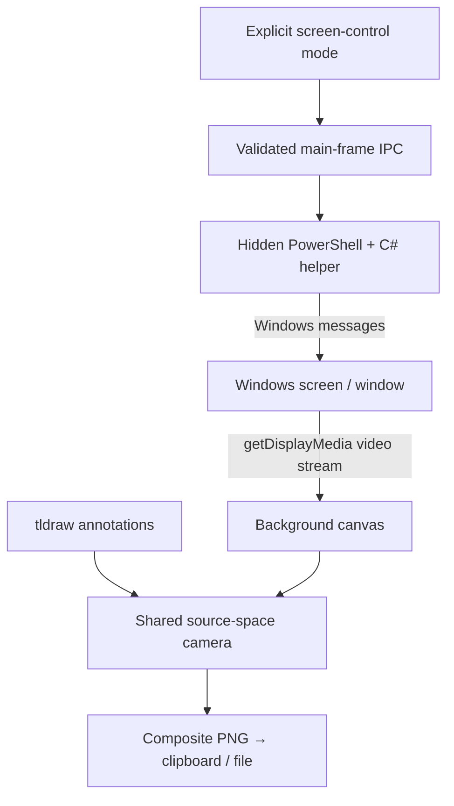

# Architecture

Live Canvas is a local Electron app with a React/tldraw renderer and an optional Windows input helper.

## Rendering and coordinates

Capture runs at a requested maximum of 30 fps. A video element feeds a background canvas. Frames are not inserted into React state or the tldraw document store. The frame loop paints only when the video timestamp changes.

`src/geometry.mjs` is the coordinate authority. It calculates the source rectangle, visible page, zoom, and remote-input mapping. tldraw's camera and the background use the same source-space coordinates. Navigation expands beyond a crop without moving the stored annotations. Exports snapshot the background and render ink over the same visible bounds.

`src/useViewGestures.ts` reserves touch for view navigation. Pen/mouse input remains available to tldraw or explicit source control. UI controls are excluded from gestures.

## Native boundaries

`electron/main.cjs` owns screen selection, capture permissions, window controls, and clipboard/file operations. The renderer is sandboxed with Node integration disabled and context isolation enabled. IPC is exposed through a narrow preload interface; privileged handlers verify the main frame. New windows and renderer navigation are blocked.

`electron/input.cjs` runs a hidden PowerShell helper that compiles `InputBridge.cs` using Windows APIs. Source input is enabled explicitly. Crop/zoom mapping is resolved before forwarding. Queued events are discarded when their control session ends. The helper releases held mouse buttons when control stops or stdin closes.

Native Windows message forwarding is not a general remote-control solution. Scrolling and application compatibility remain limitations. No global input hooks, mouse-pointer warping, or security-prompt control are implemented.

## Packaging and licensing

Vite writes `dist/runtime.json` from `LIVE_CANVAS_HOST`. Electron serves those bundled files over the local `live-canvas` scheme. The hostname must match the builder's tldraw license. The public default is a placeholder local hostname; no maintainer key is shipped.

Packaging stages fresh renderer and Electron directories before building an installer. It excludes developer environment files and old build output. Installed production apps ignore the development-server override.

## Storage and network

Screen frames and annotation state are in memory. Preferences remember display/fullscreen choices. PNG files are saved only through the user's save action; clipboard copy is explicit. Sessions are not persisted.

There is no app-owned upload, chat submission, or analytics backend. Dependency licensing behavior remains unchanged; see the tldraw documentation, especially for trial licenses. Fonts, icons, and translations are bundled.
