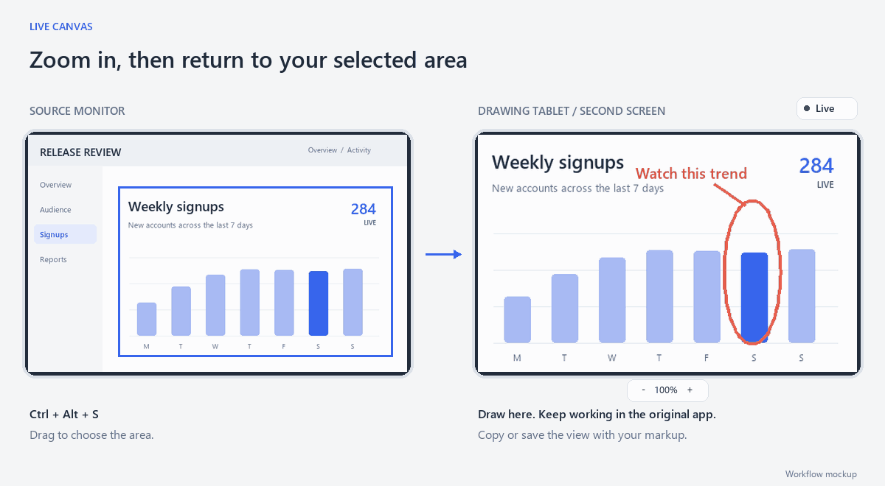
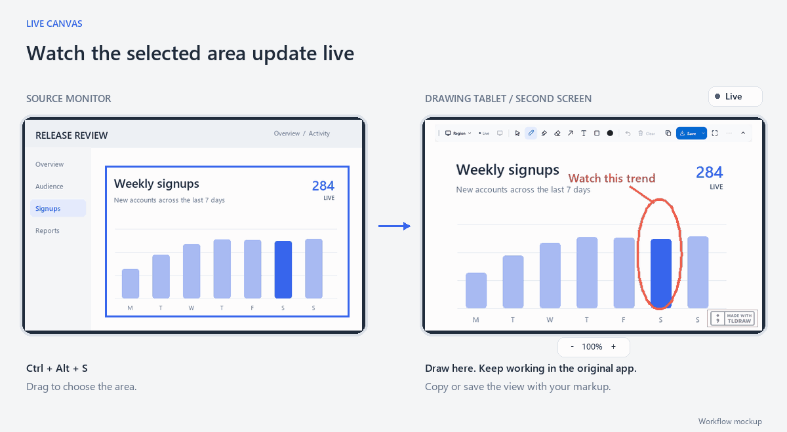

# Live Canvas in motion

## Select an area and draw over its live view

Drag a rectangle on one monitor. The selected area appears on another screen and keeps updating while you annotate it.

## Zoom in and back out

Enlarge the view to work on a detail. The annotations scale with it, and the original application stays unchanged.

## Freeze a moment

Hold the image on your second screen while the source keeps changing. Resume to catch up with the live view.

These animations show the workflow in a two-screen mockup. [See the app interface](../screenshots/annotate.png) or [read the user guide](../guide.md).
