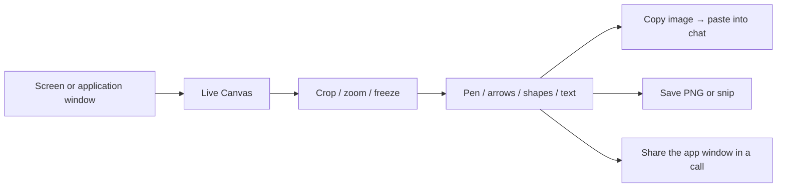

# Using Live Canvas

## Capture → annotate → share

Choose a source from the top-left menu. For a native region capture, use **Capture region** or **Ctrl+Alt+S**. The global shortcut targets the display under your pointer. The menu action uses the selected monitor, or the primary monitor if none is selected.

## Select and screen control are separate

**Select** always edits your ink. The **monitor button beside Live** explicitly enables source control. Choosing another drawing tool or Select stops source control. Escape exits screen control when its input layer has focus. A completed source click focuses the real source window so keyboard input can go there.

Input forwarding uses Windows messages, not mouse warping. It is experimental and does not work with every app. Native scrolling currently fails the compatibility test. Local Ctrl+wheel view zoom is separate and tested.

## Crop, zoom, and freeze

- **Crop view:** drag a rectangle to focus the picture. Existing ink stays in source coordinates.
- **Reset crop:** return to the full source.
- **Zoom −/+ or Ctrl+wheel:** scale the view. Zoom out can reveal the source beyond a crop.
- **Percentage button:** reset zoom to the chosen crop and current Fill/Fit mode.
- **Touchscreen / precision trackpad:** pinch to zoom; touch drag pans. Fingers navigate rather than draw. A pen still draws.
- **Fill:** preserve proportions while filling the window, trimming edges as needed.
- **Fit:** show the entire selected region with white margins as needed.
- **Freeze / Resume:** hold a full-source frame, then return to the live stream.

The Kamvas 13 is pen-only, so its screen cannot detect a finger pinch.

## Save and copy

**Copy image** puts the visible background and ink on the clipboard. Paste into your chat, document, or editor yourself. **Save** writes a PNG through a normal file picker. The Save dropdown offers **Save snip** for a smaller export. App controls and selection handles are excluded.

Live Canvas has no chat integration, account system, or meeting service. Share its window using your meeting app's normal controls. Editable work is not restored after closing, so save first.

## Shortcuts

| Shortcut     | Action                                            |
| ------------ | ------------------------------------------------- |
| Ctrl+Alt+S   | Capture a region on the display under the pointer |
| Ctrl+Shift+V | Paste a clipboard screenshot                      |
| Ctrl+Shift+C | Copy picture + ink                                |
| Ctrl+Shift+S | Save picture + ink                                |
| Ctrl+wheel   | Zoom the local view                               |
| Escape       | Cancel selection or exit focused screen control   |
| F11          | Toggle full screen                                |

## Troubleshooting

**No live image:** reselect a visible window; protected content and minimized apps may not capture normally. Avoid capturing the same monitor on which you display Live Canvas.

**Can't move an annotation:** choose Select instead of the monitor control button.

**Source app ignores input:** exit screen control and interact with that app directly. Elevated/raw-input apps may reject forwarded messages; scrolling remains experimental.

**Production canvas is unavailable:** check your tldraw license key, expiry, and `LIVE_CANVAS_HOST`, then rebuild. Use `pnpm dev` for local development. Do not remove or bypass SDK license checks.
